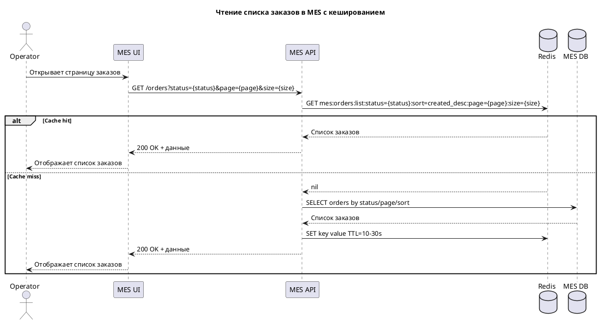
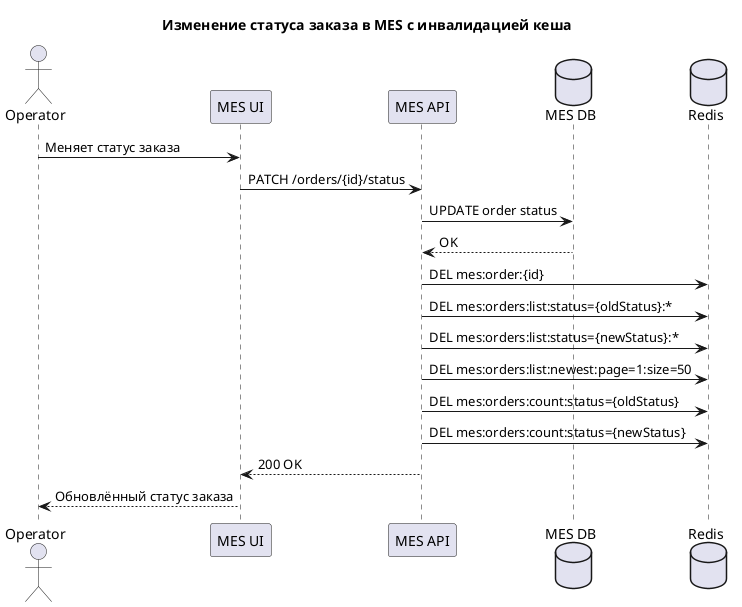

## Мотивация:

В текущем решении операторы жалуются на скорость работы MES, а новых клиентов не устраивает скорость выполнения заказов. Из-за того, что первая
страница работает долго, то я предлагаю кешировать первую странцу MES - то, что привносит наибольшее недовольство операторов. Кеширование позволит
снизить latency загрузки первой страницы, что увеличит скорость работы операторв, что будет вести к увеличению прибыли как компании, так и операторов.
Также это снизит недовольстро клиентов связанное со скоростью выполения заказов. Кеширование также снижает нагрузку на БД и уменьшает время ответа
API.

Предлагаю включить в кеширование следующие элементы:

* список заказов для MES dashboard
* особенно выборки:
    * по статусу
    * по сортировке “сначала новые”
    * по страницам / лимитам
    * агрегаты для счётчиков по статусам, если они есть на экране

## Предлагаемое решение:

**В качестве кеша используется Redis.**

**Внедрять будем серверное кеширование.**

Плюсы серверного кеша:

* снимет нагрузку с MES DB
* ускорит выдачу одинаковых популярных запросов
* позволит централизованно контролировать инвалидацию
* лучше подходит для shared data, которую читают много операторов

Клиентское кеширование здесь слабее, потому что:

* у операторов критична актуальность новых заказов
* данные общие для многих пользователей
* список постоянно меняется из-за смены статусов
* фронтенд-кеш не снимет нагрузку с БД и MES API так, как серверный

### **Выбранный паттерн кеширования: Cache-Aside.**

#### Почему подходит:

* основной сценарий — много чтений, меньше записей
* можно гибко кешировать только горячие выборки
* не требует прокидывать каждую запись через кеш при write-path
* проще внедрить поэтапно

#### Почему не Write-Through:

* важны не отдельные заказы, а списки/выборки
* запись статуса будет затрагивать много представлений:
    * список по статусу
    * первую страницу новых заказов
    * счётчики
* поддерживать консистентную запись во все кеши при каждом апдейте сложнее и дороже

#### Почему не Refresh-Ahead

Refresh-Ahead может быть полезен потом, но не как базовый паттерн.

Он хорош, если:

* есть очень предсказуемые горячие ключи

Но у нас:

* фильтры и страницы могут быть разными
* есть риск греть лишние данные
* сначала лучше сделать простой и управляемый Cache-Aside

### Стратегия инвалидации кеша

Используется **комбинированная стратегия**:

- программная инвалидация (по ключу / префиксу);
- TTL (временная инвалидация).

#### Программная инвалидация

При изменении статуса заказа:

- инвалидируется:
    - `mes:order:{orderId}`;
    - списки по старому статусу;
    - списки по новому статусу;
    - список новых заказов;
    - счётчики по статусам.

#### TTL

Используется как дополнительная защита от устаревших данных:

- списки заказов: 10–30 секунд;
- счётчики: 5–15 секунд;
- карточка заказа: 30–60 секунд.

### Почему выбран данный подход

| Стратегия                   | Оценка                                           |
|-----------------------------|--------------------------------------------------|
| Комбинированная (выбранная) | Баланс между актуальностью и производительностью |
| Только TTL                  | Риск устаревших данных                           |
| Только программная          | Сложность и риск ошибок                          |
| Полная очистка кеша         | Неэффективно, высокая нагрузка                   |

### Диаграммы последовательности:

